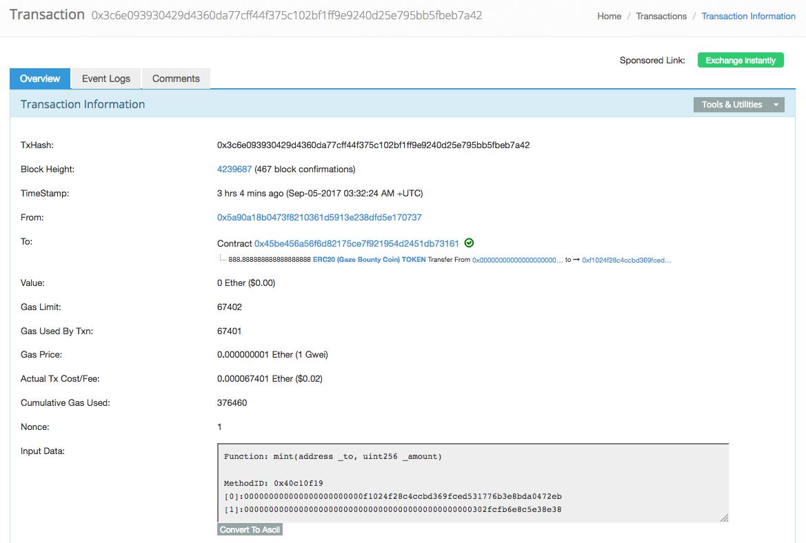
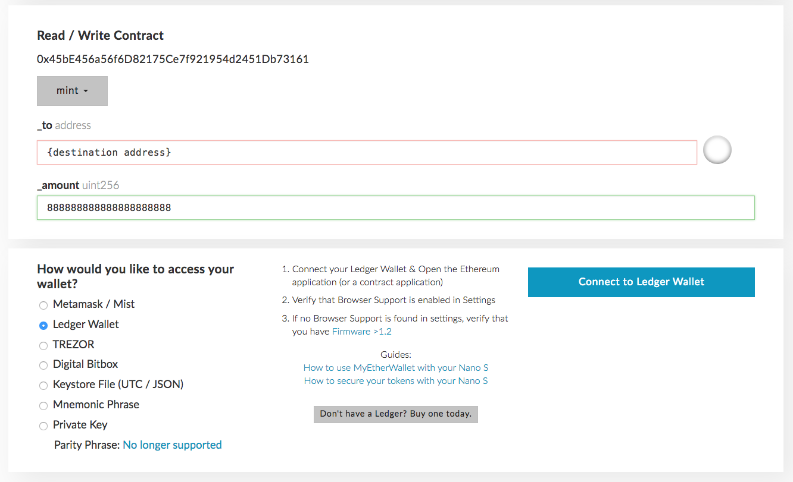
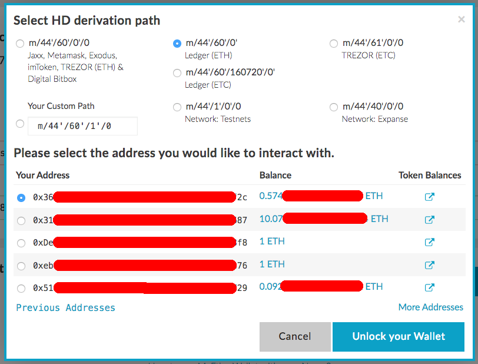
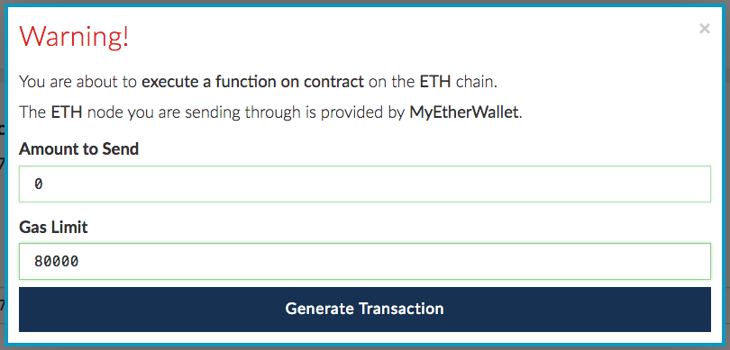
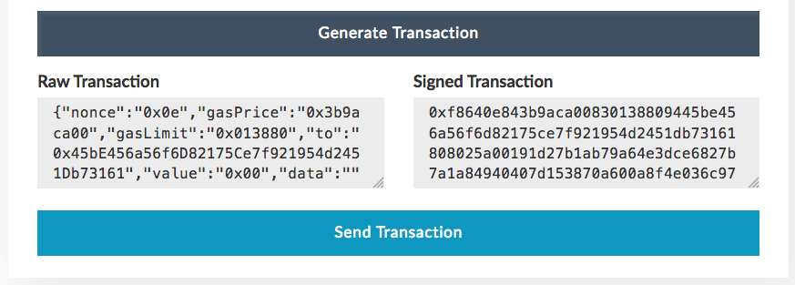
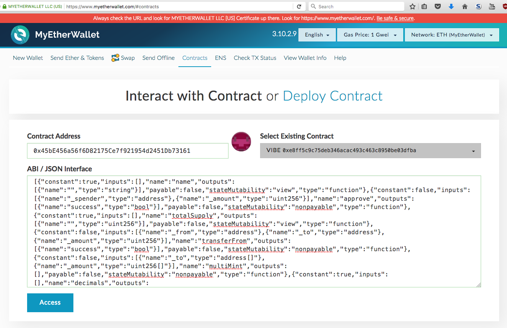

# Gaze Bounty Coin Contract

This is the Gaze Bounty Coin (GBC) that will eventually be converted into the Gaze Coin at the end of the Gaze Coin crowdsale.

The GBC token contract is deployed to [0x45bE456a56f6D82175Ce7f921954d2451Db73161](https://etherscan.io/token/0x45bE456a56f6D82175Ce7f921954d2451Db73161#balances).

GBC token transfers can be viewed at [https://etherscan.io/token/0x45bE456a56f6D82175Ce7f921954d2451Db73161](https://etherscan.io/token/0x45bE456a56f6D82175Ce7f921954d2451Db73161).

The first ever 888.888888888888888888 GBC minted - [0x3c6e0939](https://etherscan.io/tx/0x3c6e093930429d4360da77cff44f375c102bf1ff9e9240d25e795bb5fbeb7a42):

<kbd></kbd>

You can see the source code in [contracts/GazeBountyCoin.sol](contracts/GazeBountyCoin.sol).

 

## Table Of Contents

* [Minting GBCs With MyEtherWallet](#minting-gbcs-with-myetherwallet)
  * [Minting GBCs With MyEtherWallet Using Ledger Nano S](#minting-gbcs-with-myetherwallet-using-ledger-nano-s)
* [Setting Up The GBC Contract In MyEtherWallet](#setting-up-the-gbc-contract-in-myetherwallet)

 

## Minting GBCs With MyEtherWallet

Your account will need to be set up as an admnistrator account in the GBC token contract.

Navigate to [https://www.myetherwallet.com/](https://www.myetherwallet.com/#contracts) and select the **Contracts** tab.

See [Setting Up The GBC Contract In MyEtherWallet](#setting-up-the-gbc-contract-in-myetherwallet).

* Enter destination account

* Enter amount

 

### Minting GBCs With MyEtherWallet Using Ledger Nano S

Select the **Ledger Wallet** option, then click **Connect to Ledger Wallet**:

<kbd></kbd>

Select the account you want to use to execute this transaction, then click **Unlock your Wallet**:

<kbd></kbd>

Click **WRITE**

<kbd></kbd>

Click **Generate Transaction**

Authorise the transaction on your Ledger Nano S device. Check the transaction details, then click on the right button.

<kbd></kbd>

Click **Send Transaction**

Your minting transaction should appear in [https://etherscan.io/address/0x45bE456a56f6D82175Ce7f921954d2451Db73161](https://etherscan.io/address/0x45bE456a56f6D82175Ce7f921954d2451Db73161).

When minted, your token transfer should appear in [https://etherscan.io/token/0x45bE456a56f6D82175Ce7f921954d2451Db73161](https://etherscan.io/token/0x45bE456a56f6D82175Ce7f921954d2451Db73161).

 

## Setting Up The GBC Contract In MyEtherWallet

Navigate to [https://www.myetherwallet.com/](https://www.myetherwallet.com/#contracts) and select the **Contracts** tab.

In the **Contract Address** field, enter `0x45bE456a56f6D82175Ce7f921954d2451Db73161`.

In the **ABI / JSON Interface** text box, copy and paste the following text:

> [{"constant":true,"inputs":[],"name":"name","outputs":[{"name":"","type":"string"}],"payable":false,"stateMutability":"view","type":"function"},{"constant":false,"inputs":[{"name":"_spender","type":"address"},{"name":"_amount","type":"uint256"}],"name":"approve","outputs":[{"name":"success","type":"bool"}],"payable":false,"stateMutability":"nonpayable","type":"function"},{"constant":true,"inputs":[],"name":"totalSupply","outputs":[{"name":"","type":"uint256"}],"payable":false,"stateMutability":"view","type":"function"},{"constant":false,"inputs":[{"name":"_from","type":"address"},{"name":"_to","type":"address"},{"name":"_amount","type":"uint256"}],"name":"transferFrom","outputs":[{"name":"success","type":"bool"}],"payable":false,"stateMutability":"nonpayable","type":"function"},{"constant":false,"inputs":[{"name":"_to","type":"address[]"},{"name":"_amount","type":"uint256[]"}],"name":"multiMint","outputs":[],"payable":false,"stateMutability":"nonpayable","type":"function"},{"constant":true,"inputs":[],"name":"decimals","outputs":[{"name":"","type":"uint8"}],"payable":false,"stateMutability":"view","type":"function"},{"constant":false,"inputs":[{"name":"_adminAddress","type":"address"}],"name":"removeAdministrators","outputs":[],"payable":false,"stateMutability":"nonpayable","type":"function"},{"constant":false,"inputs":[],"name":"seal","outputs":[],"payable":false,"stateMutability":"nonpayable","type":"function"},{"constant":false,"inputs":[{"name":"_to","type":"address"},{"name":"_amount","type":"uint256"}],"name":"mint","outputs":[],"payable":false,"stateMutability":"nonpayable","type":"function"},{"constant":true,"inputs":[{"name":"_account","type":"address"}],"name":"balanceOf","outputs":[{"name":"balance","type":"uint256"}],"payable":false,"stateMutability":"view","type":"function"},{"constant":true,"inputs":[{"name":"","type":"address"}],"name":"administrators","outputs":[{"name":"","type":"bool"}],"payable":false,"stateMutability":"view","type":"function"},{"constant":false,"inputs":[],"name":"acceptOwnership","outputs":[],"payable":false,"stateMutability":"nonpayable","type":"function"},{"constant":true,"inputs":[],"name":"owner","outputs":[{"name":"","type":"address"}],"payable":false,"stateMutability":"view","type":"function"},{"constant":false,"inputs":[{"name":"_adminAddress","type":"address"}],"name":"addAdministrators","outputs":[],"payable":false,"stateMutability":"nonpayable","type":"function"},{"constant":true,"inputs":[],"name":"symbol","outputs":[{"name":"","type":"string"}],"payable":false,"stateMutability":"view","type":"function"},{"constant":false,"inputs":[{"name":"_to","type":"address"},{"name":"_amount","type":"uint256"}],"name":"transfer","outputs":[{"name":"success","type":"bool"}],"payable":false,"stateMutability":"nonpayable","type":"function"},{"constant":true,"inputs":[],"name":"newOwner","outputs":[{"name":"","type":"address"}],"payable":false,"stateMutability":"view","type":"function"},{"constant":false,"inputs":[{"name":"tokenAddress","type":"address"},{"name":"amount","type":"uint256"}],"name":"transferAnyERC20Token","outputs":[{"name":"success","type":"bool"}],"payable":false,"stateMutability":"nonpayable","type":"function"},{"constant":true,"inputs":[{"name":"_owner","type":"address"},{"name":"_spender","type":"address"}],"name":"allowance","outputs":[{"name":"remaining","type":"uint256"}],"payable":false,"stateMutability":"view","type":"function"},{"constant":true,"inputs":[],"name":"sealed","outputs":[{"name":"","type":"bool"}],"payable":false,"stateMutability":"view","type":"function"},{"constant":false,"inputs":[{"name":"_newOwner","type":"address"}],"name":"transferOwnership","outputs":[],"payable":false,"stateMutability":"nonpayable","type":"function"},{"inputs":[],"payable":false,"stateMutability":"nonpayable","type":"constructor"},{"payable":false,"stateMutability":"nonpayable","type":"fallback"},{"anonymous":false,"inputs":[{"indexed":false,"name":"adminAddress","type":"address"}],"name":"AdminstratorAdded","type":"event"},{"anonymous":false,"inputs":[{"indexed":false,"name":"adminAddress","type":"address"}],"name":"AdminstratorRemoved","type":"event"},{"anonymous":false,"inputs":[{"indexed":true,"name":"_from","type":"address"},{"indexed":true,"name":"_to","type":"address"}],"name":"OwnershipTransferred","type":"event"},{"anonymous":false,"inputs":[{"indexed":true,"name":"_from","type":"address"},{"indexed":true,"name":"_to","type":"address"},{"indexed":false,"name":"_value","type":"uint256"}],"name":"Transfer","type":"event"},{"anonymous":false,"inputs":[{"indexed":true,"name":"_owner","type":"address"},{"indexed":true,"name":"_spender","type":"address"},{"indexed":false,"name":"_value","type":"uint256"}],"name":"Approval","type":"event"}]

The same text can also be copied from [https://etherscan.io/address/0x45be456a56f6d82175ce7f921954d2451db73161#code](https://etherscan.io/address/0x45be456a56f6d82175ce7f921954d2451db73161#code)
in the **Contract ABI** field.

<kbd></kbd>

Click on the **Access** button to view the list of functions you can read or write to:

<kbd></kbd>

 

 

Enjoy. (c) BokkyPooBah / Bok Consulting Pty Ltd for Gaze 2017. The MIT Licence.